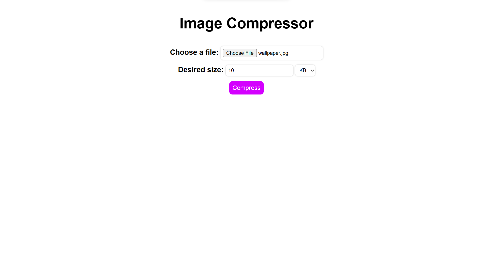
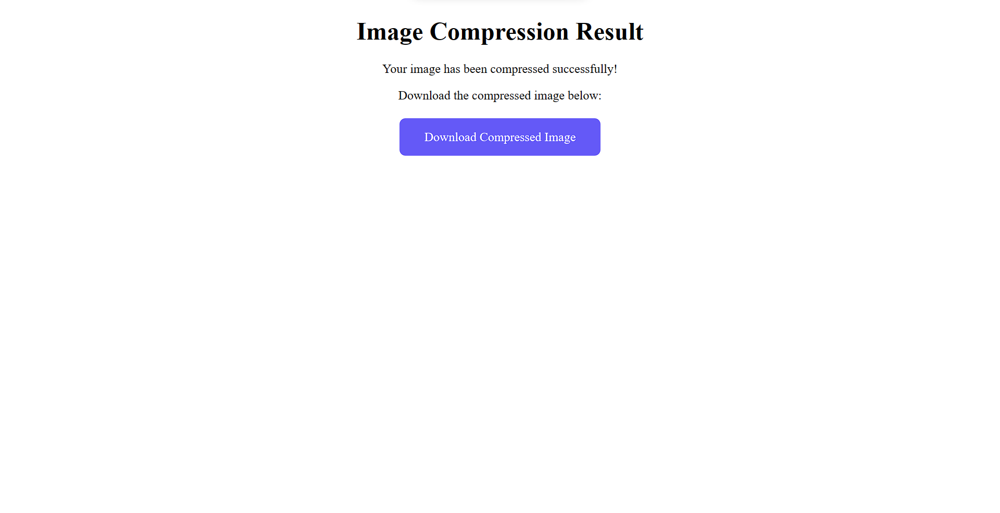

# **Steps to Follow**

## Create Virtual environment

1. pip install virtualenv
2. python -m virtualenv ivenv
3. ivenv\Scripts\activate

## Install required Libraries

1. pip install flask
2. pip install pillow

## Run the command in CMD at the 'img_compressor.py' path.

    Set FLASK_APP = img_compressor.py

    Set FLASK_ENVIRONMENT = development

    flask run

##### Index Page

##### Result Page

##### Image with high Quality

##### Compressed_img

